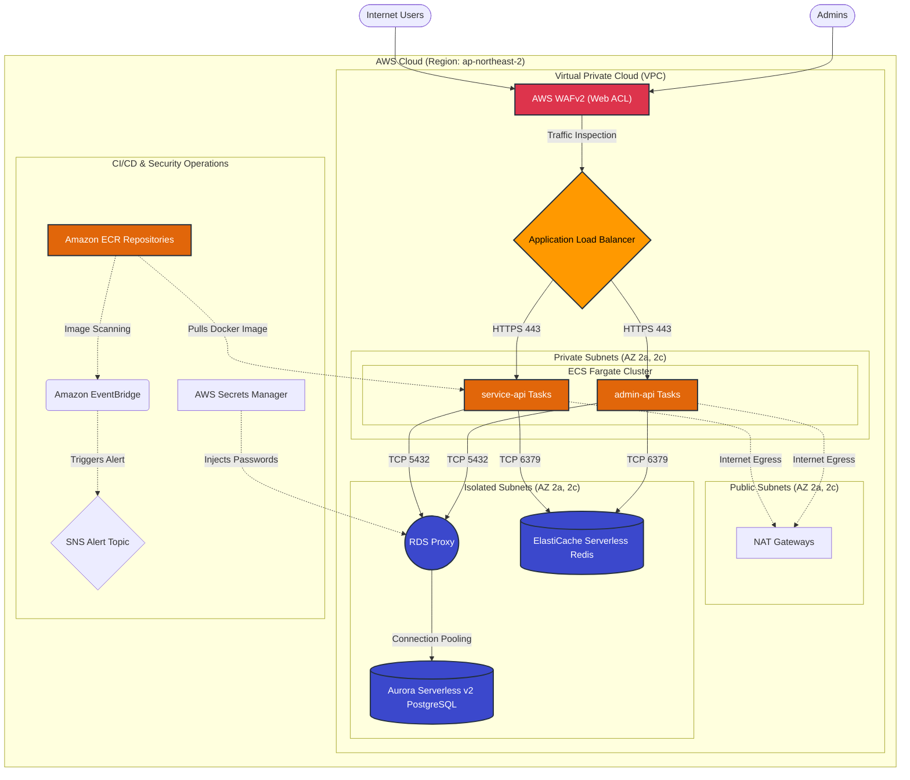

# Chassis Infrastructure Architecture

This repository contains the declarative AWS infrastructure for the Ktor Chassis platform, written in Pulumi and TypeScript. The architecture is designed for **High Availability (HA)**, **Zero-Downtime Deployments**, **Enterprise Security**, and **Serverless Cost Scaling**.

## Architecture Diagram

## Core Components & Intent

### 1. Networking (`src/vpc.ts`)
*   **Intent**: Create a zero-trust, highly available network topology that strictly physically isolates sensitive datastores from the public internet, while aligning with NCP latency requirements.
*   **Multi-AZ Distribution**: The VPC spans exactly two Availability Zones (`ap-northeast-2a` and `ap-northeast-2c`) to ensure that a complete physical datacenter failure in one AZ does not take down the platform.
*   **Subnet Strategy**: 
    1.  **Public Subnets**: The DMZ. This houses the Application Load Balancers and NAT gateways. It is the only tier where inbound internet traffic is legally permitted to enter.
    2.  **Private Subnets**: The application tier. This houses the ECS Fargate containers (`service-api`, `admin-api`). These subnets have no inbound internet access, guaranteeing containers cannot be directly reached by attackers. They egress to the internet (e.g., to pull Docker images or hit third-party APIs) implicitly through the NAT Gateways.
    3.  **Isolated Subnets**: The secure data tier. This houses all stateful storage (Aurora Database, ElastiCache Redis). These subnets lack a route to the NAT Gateways, meaning they have **zero** physical route to the internet at all.
*   **Cost Optimization**: In development environments, only a single NAT Gateway is provisioned to heavily reduce hourly AWS fees. In production, one NAT Gateway is provisioned per AZ for strict high availability.

### 2. Computing & Security (`src/compute.ts`)
*   **Intent**: Provide a serverless, highly-scalable, and secure compute execution environment for the Ktor applications.
*   **ECS Fargate**: Completely abstracts away underlying EC2 node management. Applications run as serverless containers, eliminating OS-level patching and AMI maintenance.
*   **Application Load Balancer (ALB)**: 
    *   **HTTPS Enforcement**: The ALB utilizes two listeners. The Port 80 listener acts exclusively as a strict `HTTP 301 Permanent Redirect` to force all clients onto HTTPS.
    *   **TLS Termination**: The Port 443 listener dynamically fetches the latest validated ACM Certificate (based on the `domainName` Pulumi config) to terminate TLS traffic encrypting data in transit.
    *   **Packet Security**: Configured to actively `dropInvalidHeaderFields`, effectively mitigating modern HTTP desync and request smuggling injection attacks.
    *   **Path-Based Routing**: Translates the single domain entry point into discrete microservices via Listener Rules (e.g., `/service/*` routes to the Service API Target Group, `/admin/*` routes to the Admin API Target Group).
*   **Web Application Firewall (WAFv2)**: Attached directly to the ALB to inspect payloads before they reach the Ktor applications logic.
    *   **Managed Rule Sets**: Employs the `AWSManagedRulesCommonRuleSet` and `AWSManagedRulesSQLiRuleSet` to deflect known CVE vulnerabilities and SQL injection attempts.
    *   **Custom Rate Limiting**: Features a specialized `AdminPathRateLimit` rule that strictly caps inbound IP addresses attempting to hit the sensitive `/admin/` path to 100 requests per 5 minutes, mitigating brute-force and credential stuffing attacks without impacting standard API throughput.
*   **Application Auto Scaling**: 
    *   Maintains a minimum `DesiredCount` of 2 tasks per service in production for High Availability across AZs.
    *   Employs a **Target Tracking Policy** mapped to `ECSServiceAverageCPUUtilization`. Placed at a strict 70.0% utilization threshold, the cluster aggressively scales out (up to 50 containers) with a rapid 60-second cooldown during traffic spikes, and gracefully scales in with a conservative 5-minute cooldown to prevent thrashing.
*   **Granular Sizing**: Containers compute resources are parameterized, allowing development APIs to utilize cost-effective 0.5 vCPU / 1GB RAM footprints, while production APIs launch with 1 vCPU / 2GB RAM.
*   **Observability**: Integrated deeply with AWS CloudWatch logs natively via `awslogs` driver, and utilizes ECS **Container Insights** to generate granular, Datadog-level dashboards for task CPU, memory, and network throughput without requiring third-party sidecar agents.

### 3. Data Storage (`src/database.ts` & `src/cache.ts`)
*   **Intent**: Deploy deeply persistent, instantaneously scalable datastores accessed safely through intelligent connection poolers and strict credential boundaries.
*   **Aurora Serverless v2 (PostgreSQL 15)**: 
    *   A cloud-native relational database that dynamically scales memory and CPU vertically in microseconds. 
    *   Production instances fluidly float between 2.0 ACU and massive 128.0 ACU ceilings based precisely on live query demand.
    *   **Resiliency**: Configured with a Multi-AZ cluster topology (1 Writer, 1 Reader). Employs automated Application Auto Scaling for Readers, smoothly growing up to 15 concurrent replicas if `RDSReaderAverageCPUUtilization` breaches 70%.
    *   **Protection**: Pulumi is physically restricted from destroying the cluster via `deletionProtection`, and `performanceInsightsEnabled` gives developers rich SQL query execution breakdown times natively in the console.
    *   **Automated Database Provisioning**: Pulumi dynamically handles non-production data strategies:
        *   **Persistent Dev Environments**: By providing a `restoreSnapshotId` configuration, Pulumi builds the Dev DB entirely from a pseudonymized production snapshot and utilizes `applyImmediately` to forcefully rotate the inherited production root passwords into secure Dev equivalents before allowing the application to connect.
        *   **Ephemeral Staging Environments**: By providing a `cloneSourceClusterId` architecture, CI/CD pipelines can spin up ultra-fast, copy-on-write replica clusters directly from the live `prod` database. This enables integration testing against massive production datasets in seconds, without paying the compute or storage penalty of manual snapshot restoration.
*   **RDS Proxy**: 
    *   Placed as a middleware between the ECS Ktor containers and Aurora. This critically prevents Ktor containers (which may autoscale up to 50 instances) from accidentally exhausting the underlying PostgreSQL connection limits by actively pooling, multiplexing, and throttling internal network queries.
    *   **IAM Authentication**: Uniquely integrates with **AWS Secrets Manager**, hiding the raw database connection strings from environment variables. The Fargate containers exclusively authenticate to the Proxy using short-lived IAM tokens rather than hardcoded PostgreSQL passwords.
*   **ElastiCache Serverless (Redis)**: 
    *   Requires zero cluster management. Instantly scales to handle massive traffic for fast-lookups.
    *   Development usage is strictly capped at 1GB data storage and 5,000 ECPUs to prevent runaway costs, while production instances are unleashed to support massive throughput.

### 4. CI/CD Pipeline & Security Alerts (`src/ecr.ts` & `src/notifications.ts`)
*   **Intent**: Integrate the unchangeable infrastructure deeply with application deployment schedules, enforcing robust cost-hygiene and active security auditing.
*   **Amazon ECR Repositories**: Managed repositories uniquely generated per microservice (`chassis/prod/service`, `chassis/prod/admin`). An intelligent Lifecycle algorithm actively deletes Docker images older than 30 versions to significantly slash AWS storage costs over time.
*   **Active Vulnerability Scanning Network**: 
    1.  When new application code is pushed to ECR via CI/CD, ECR automatically performs a deep CVE Image Scan (`scanOnPush: true`).
    2.  If CRITICAL or HIGH severity package vulnerabilities are discovered (e.g., an outdated Log4j or OpenSSL dependency inside the Docker container), AWS EventBridge immediately intercepts the internal ECR event stream.
    3.  EventBridge actively forwards the payload to a strict FIFO **SNS Topic**, which can immediately broadcast to Developer Slack Webhooks or Email addresses to alert the team of a critical vulnerability before the image even boots inside the Fargate cluster.
